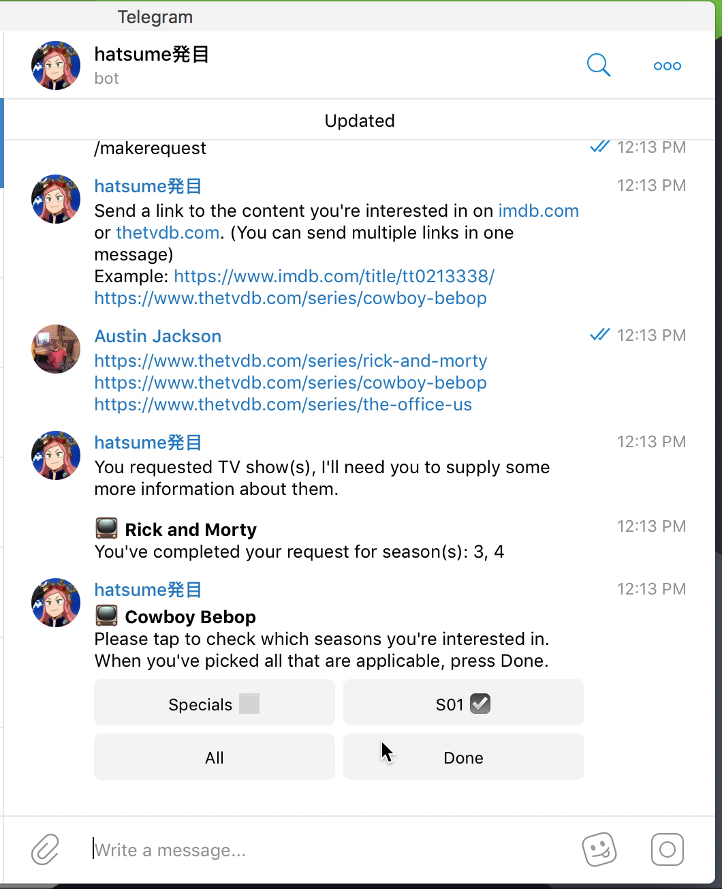

 

# hatsume
Telegram bot to act as a courier for Plex content requests.

## ️️⚠️ Road to v1.0.0 ⚠️

Currently, hatsume is in a semi-functioning state. To get an idea of where I am in the project so far, here are the features that are to be completed by the v1.0.0 release.
- [X] `/enroll`: register a user to hatsume's database. Accepts a Plex username to check against users on server maintainer's friend list, and against already enrolled users (no dupes)
- [X] `/makerequest`: accepts IMDb or TVDb link(s) from an authenticated user and save it to the database. Query APIs to fill unknown data.
- [X] Regularly poll Plex server and notify a user if their request has been filled
- [X] Forward requests to a Telegram channel for the server maintainer to see
- [X] [Request specific season(s) of a show](https://github.com/au5ton/hatsume/issues/9)
- [ ] [Opt-in to Sonarr notifications](https://github.com/au5ton/hatsume/issues/13)
- [ ] [Implement maintainer tools](https://github.com/au5ton/hatsume/issues/4)
- [ ] Improve code quality to match Google guidelines
- [ ] Other features maybe
- [ ] Fix some bugs along the way

## Running an instance

Hatsume is tested in Node.js v10.x and uses some ES7 features available only in Node.js v7.x and up. Keep this in mind when deploying.

### Hatsume depends on the following APIs. You'll need to supply API keys from them:
- https://core.telegram.org/bots/api#authorizing-your-bot
- http://www.omdbapi.com/
- https://api.thetvdb.com/swagger
- https://www.themoviedb.org/documentation/api

### To get started:
- Clone repo and install dependencies:
- `git clone https://github.com/au5ton/hatsume.git`
- `npm install`
- [Setup mySQL or MariaDB (MariaDB please)](https://www.digitalocean.com/community/tutorials/how-to-install-mariadb-on-centos-7)
- Import the SQL database: 
- `mysql -u [username] -p newdatabase < sql/hatsume_db.sql`
- Setup environment variables:
- `cp .env.example .env`
- `nano .env`
- Run the bot:
- `node bot.js`
- If all startup checks pass, you're good to go!

## Demo

## Usage

## Operation

##### Character

*hatsume_bot is based off of Mei Hatsume, a character from Boku no Hero Academia (僕のヒーローアカデミア) and is property of [Bones Inc](http://www.bones.co.jp/).*
